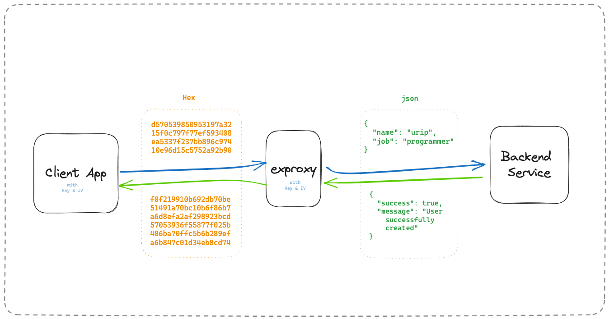

# exproxy
very simple proxy to encrypt your rest api



To install dependencies:

```bash
npm i
```

To run:

```bash
npm start
```

Running with docker

```yaml
version: "3.6"
services:
  proxy:
    container_name: "exproxy"
    image: "subekti13/exproxy:latest"
    ports:
      - 3112:3000
    restart: "unless-stopped"
    environment:
      - ENCRYPT=1
      - ENABLE_PLAYGROUND=1
      - ENCRYPT_KEY=172695c533f01a99281f22c1877742f6b373069e4cbee82855c17baa61b58611
      - ENCRYPT_IV=7727068a9916f3f6a5ba0d8f459d70e3
      - TOKEN=__ini_token
```
